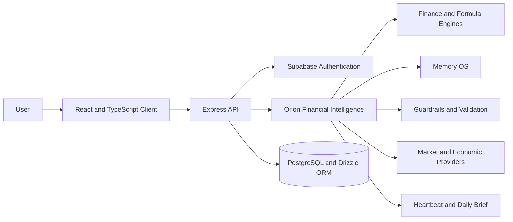

  

# Prometheus AI

### Explainable Financial Intelligence Powered by Orion

**A completed AI engineering portfolio project that combines financial reasoning, contextual memory, market intelligence, deterministic calculations, and responsible decision support.**

[Launch Live Application](https://asset-manager-rasheekf.replit.app/) · [Architecture](docs/ARCHITECTURE.md) · [Orion Core](docs/ORION_CORE.md) · [Security](docs/SECURITY.md) · [Roadmap](docs/ROADMAP.md)

---

## Overview

Prometheus is an AI powered financial intelligence platform designed to help people understand financial choices, calculations, risks, and tradeoffs in plain language. Its core assistant, **Orion**, is built to behave more like a real time personal CFO than a general purpose chatbot.

Instead of returning vague financial advice, Orion is designed to detect the user's situation, apply relevant finance logic, perform or validate calculations, consider risk boundaries, and present clear next actions with assumptions and limitations.

Prometheus began as a product vision at the intersection of finance and artificial intelligence and evolved into a working platform that demonstrates full stack product development, AI orchestration, financial model design, memory architecture, external data integration, and responsible AI thinking.

> **Mission:** Make high quality financial intelligence understandable and accessible to people who do not have a personal financial advisor.

## Live Product

**Application:** https://asset-manager-rasheekf.replit.app/

The deployed product is the primary demonstration of the user experience. This public repository serves as the recruiter facing technical showcase and intentionally excludes proprietary Orion source, credentials, production configuration, and user data.

## Product Capabilities

### Orion Financial Intelligence

- Conversational financial analysis and decision support
- Situation detection that selects relevant financial workflows
- Deterministic formula support for numerical accuracy
- Explainable outputs with assumptions, risks, and next steps
- Financial guardrails and validation
- Contextual memory for more personalized guidance

### Money Map

- Financial position and trajectory
- Goal based projections
- Savings and allocation scenarios
- Action oriented optimization recommendations

### Framework Library

- Structured investing and decision frameworks
- Finance concepts translated into usable decision systems
- Support for accounting, tax, bonds, ETFs, corporate finance, and venture capital knowledge

### Market Intelligence

- Market and company data adapters
- Macroeconomic indicators
- Regulatory and filing data
- Provider integrations for Alpha Vantage, Finnhub, FRED, and SEC EDGAR

### Proactive Services

- **Heartbeat:** scheduled checks for meaningful financial changes
- **Daily Brief:** structured market and financial summaries
- Memory enabled decision history and context

## Key Engineering Highlights

| Area | Implementation focus |
|---|---|
| AI orchestration | Orion coordinates situation detection, finance engines, memory, providers, validation, and response generation |
| Explainable AI | Responses emphasize assumptions, calculation logic, tradeoffs, uncertainty, and next actions |
| Financial accuracy | Deterministic formulas and a separate financial validation layer reduce numerical errors |
| Modular architecture | Engines, knowledge, memory, providers, guardrails, and scheduled services remain separable |
| Contextual memory | Memory OS retrieves permitted long term context while preserving user scoped boundaries |
| External intelligence | Provider adapters connect market, economic, and regulatory data to financial workflows |
| Responsible AI | Guardrails, disclaimers, user isolation, secret management, and safe error handling are treated as design requirements |

## System Architecture

The detailed component architecture, trust boundaries, and request lifecycle are available in [docs/ARCHITECTURE.md](docs/ARCHITECTURE.md).

## Orion Core

The reviewed Orion source contains approximately **6,173 lines of TypeScript across 28 modules** organized around:

- Financial and corporate finance engines
- Formula calculation and financial validation
- Situation detection and fact extraction
- Advisor voice and financial guardrails
- Memory OS
- Heartbeat scheduling
- Daily Brief generation
- Accounting, tax, ETF, bond, and venture capital knowledge
- Alpha Vantage, Finnhub, FRED, and SEC EDGAR providers

The public capability map is documented in [docs/ORION_CORE.md](docs/ORION_CORE.md). Complete proprietary source is intentionally maintained outside this public showcase.

## Technology Stack

| Layer | Technology |
|---|---|
| Frontend | React, TypeScript, Vite |
| Backend | Node.js, Express |
| Database | PostgreSQL, Drizzle ORM |
| Authentication | Supabase |
| AI intelligence | Orion financial reasoning engine |
| Data providers | Alpha Vantage, Finnhub, FRED, SEC EDGAR |
| Hosting | Replit |
| Source control | GitHub |

## Responsible AI and Security

Prometheus is designed around the principle that greater automation should not reduce user understanding or control.

Core safeguards include:

- Server side secret management
- Authenticated and user scoped data access
- Financial validation and deterministic calculations
- Prompt injection and tool abuse controls
- Safe error handling and bounded provider calls
- Assumption, uncertainty, and risk disclosures
- No guarantees of investment outcomes
- Separation between educational decision support and regulated financial advice

Read the complete portfolio level security overview in [docs/SECURITY.md](docs/SECURITY.md).

## Documentation

| Document | Description |
|---|---|
| [System Overview](docs/SYSTEM_OVERVIEW.md) | Product purpose, capabilities, and engineering value |
| [Architecture](docs/ARCHITECTURE.md) | System diagrams, Orion lifecycle, and architectural principles |
| [Orion Core](docs/ORION_CORE.md) | Intelligence layer, modules, explainability, and v2 direction |
| [Security](docs/SECURITY.md) | Trust boundaries, controls, privacy, and threat model |
| [Installation](docs/INSTALLATION.md) | Expected private application setup and development workflow |
| [Roadmap](docs/ROADMAP.md) | Reliability, Orion Core v2, Prometheus, and ecosystem direction |

## Installation and Source Availability

This repository is a public showcase rather than the complete production codebase. It cannot be installed as the full Prometheus application.

The private application repository follows a standard Node and TypeScript workflow with environment configuration, PostgreSQL migrations, Supabase authentication, testing, type checking, and production builds. See [docs/INSTALLATION.md](docs/INSTALLATION.md) for the documented setup model.

## Engineering Challenges Addressed

### Combining generative AI with reliable finance calculations

Financial responses cannot rely solely on language model output. Prometheus separates deterministic formulas and validation from natural language explanation so Orion can communicate results without treating generated text as the source of mathematical truth.

### Preserving context without losing privacy boundaries

Memory improves personalization, but financial context is sensitive. Orion's memory design is intended to retrieve useful context while keeping records scoped to authenticated users and preventing cross application leakage.

### Integrating inconsistent external providers

Market and economic providers differ in rate limits, schemas, availability, and timing. Provider adapters isolate those differences from the financial reasoning engine and allow the system to degrade safely when live data is unavailable.

### Making AI reasoning understandable

Prometheus does not expose private chain of thought. It provides concise reasoning summaries, assumptions, risks, and verifiable calculations so users can understand why an output was produced.

## Roadmap

The next engineering chapter centers on **Orion Core v2**, a reusable, application aware intelligence layer that can power:

- **Prometheus:** personal finance and financial strategy
- **Hermes:** commerce, pricing, inventory, sourcing, and resale analysis
- Future Orion powered applications with domain specific skills

Planned work includes stronger typing, explicit application context, skill registration, permission based tools, provider independent AI interfaces, improved test coverage, continuous integration, model evaluation, and formal memory scopes.

See [docs/ROADMAP.md](docs/ROADMAP.md) for the complete direction.

## About the Founder

**Rasheek Futrell** is an aspiring AI engineer and product founder with a background in finance, healthcare administration, and military service. Prometheus was built to combine hands on AI engineering with a practical mission: helping everyday people gain more clarity and confidence when making financial decisions.

- [LinkedIn](https://www.linkedin.com/in/rasheek-futrell-9212971b6)
- [Live Prometheus Application](https://asset-manager-rasheekf.replit.app/)

## Disclaimer

Prometheus provides educational financial information and decision support. It does not provide individualized investment, tax, legal, or regulated financial advice, and it does not guarantee financial outcomes.

## Intellectual Property

Copyright © 2026 Rasheek Futrell. All rights reserved.

The Prometheus and Orion concepts, architecture, documentation, and proprietary implementation are not offered under an open source license through this showcase repository. No permission is granted to reproduce or commercially reuse proprietary source or branding without written authorization.

---

**Built with purpose. Engineered for clarity.**

