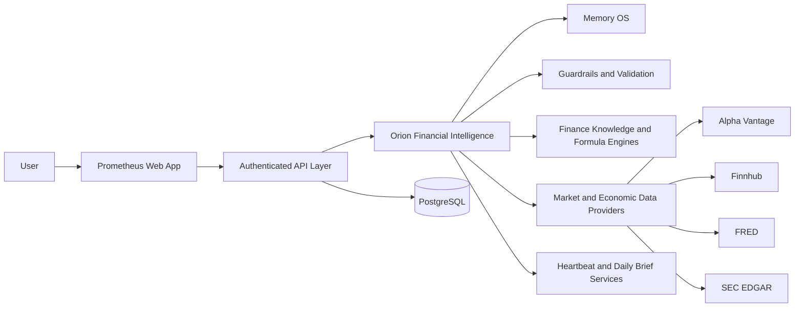
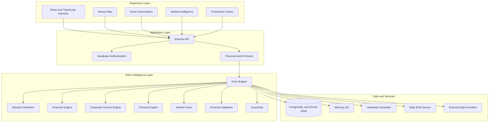
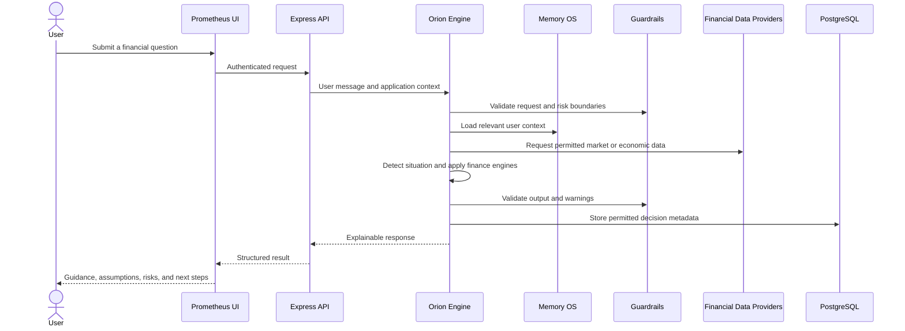

# Prometheus System Architecture

Prometheus is an explainable AI financial intelligence platform powered by Orion, a modular financial reasoning engine. This public architecture document describes the system at a portfolio level without exposing proprietary prompts, private implementation details, credentials, or user data.

## System Context

## Application Layers

## Orion Request Lifecycle

## Core Orion Modules

| Module | Responsibility |
|---|---|
| Orion Engine | Coordinates financial reasoning and response generation |
| Situation Detector | Classifies the user's financial situation and selects appropriate workflows |
| Financial Engine | Handles personal finance analysis and recommendations |
| Corporate Finance Engine | Supports valuation, capital budgeting, and business finance logic |
| Formula Engine | Performs deterministic calculations used in financial reasoning |
| Financial Validation | Checks assumptions, calculations, and output consistency |
| Guardrails | Applies safety boundaries and prevents overconfident financial claims |
| Advisor Voice | Produces clear, decision focused explanations |
| Memory OS | Stores and retrieves permitted long term user context |
| Heartbeat | Supports scheduled account and financial condition checks |
| Daily Brief | Produces structured financial and market summaries |

## Architectural Principles

1. **Explainability before automation.** Financial outputs should provide assumptions, reasoning summaries, risks, and next actions.
2. **Deterministic math where possible.** Calculations are separated from generative language to reduce numerical errors.
3. **Modular intelligence.** Knowledge, formulas, memory, providers, validation, and presentation remain separable.
4. **Server side trust boundary.** Provider keys, database access, and protected financial logic remain on the server.
5. **User scoped data.** Authentication and database controls are designed to keep one user's financial context isolated from another.
6. **Provider independence.** External market and economic data sources are wrapped behind provider modules.

## Public Showcase Boundary

This repository documents the product and its architecture. The complete Orion source, private prompts, production configuration, credentials, and user data are intentionally excluded from the public showcase.