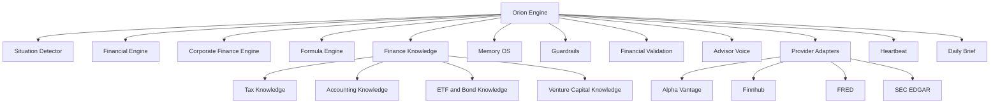

# Orion Core

Orion is the intelligence layer behind Prometheus. It combines deterministic financial calculations, financial knowledge, contextual memory, market data adapters, validation, and an explainable advisor voice.

## Public Capability Map

## Design Goals

- Turn financial questions into structured decisions rather than generic chat responses.
- Separate numerical calculations from generative explanation.
- Preserve relevant user context while maintaining user isolation.
- Provide assumptions, risks, warnings, and next actions.
- Support multiple external data providers without coupling the engine to one vendor.
- Evolve into a reusable intelligence platform for Prometheus, Hermes, and future applications.

## Current Module Groups

| Group | Examples of responsibility |
|---|---|
| Engine | Orchestration, situation detection, personal and corporate finance reasoning |
| Knowledge | Accounting, tax, investment, bond, ETF, and venture capital concepts |
| Memory | Long term context and decision history |
| Providers | Market, economic, and regulatory data adapters |
| Validation | Calculation checks, output review, and safety controls |
| Services | Heartbeat monitoring and Daily Brief generation |

## Explainability Model

Orion is designed to return more than an answer. A strong response should communicate:

1. What situation Orion detected.
2. Which assumptions were used.
3. What calculations or financial principles were applied.
4. What tradeoffs or risks matter.
5. What action the user can take next.
6. Where uncertainty or missing data limits confidence.

Orion does not expose private chain of thought. It provides concise reasoning summaries and verifiable calculations.

## Orion Core v2 Direction

The v2 architecture is intended to introduce:

- A single typed runtime entry point.
- Application context for Prometheus, Hermes, and future products.
- A skill registry separating shared, finance, and commerce capabilities.
- Provider independent AI interfaces.
- Permission based tool execution.
- Explicit memory scopes for global, application, and session context.
- Compatibility adapters that allow Prometheus to evolve without breaking working features.

The complete implementation is maintained separately from this public showcase to protect proprietary logic and reduce the risk of exposing production configuration.