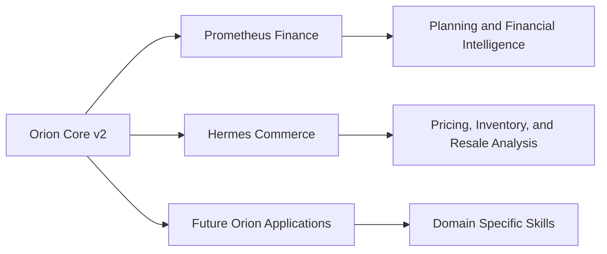

# Product and Engineering Roadmap

This roadmap describes the intended direction of Prometheus and Orion. It is directional and does not represent guaranteed release dates.

## Completed Foundation

- Prometheus web experience and public deployment
- Orion financial reasoning engine
- Personal and corporate finance modules
- Formula and financial validation engines
- Financial knowledge library
- Market and economic data provider adapters
- Memory OS
- Heartbeat scheduler
- Daily Brief service
- Public portfolio showcase

## Near Term: Portfolio and Reliability

- Complete recruiter focused documentation and visual assets
- Establish a private `orion-core-v2` repository
- Separate public product documentation from proprietary source
- Expand automated tests for calculations, memory, providers, and guardrails
- Add continuous integration for type checking, tests, builds, and secret scanning
- Improve structured logging, timeout handling, and safe provider fallback

## Orion Core v2

- Introduce a single typed Orion runtime
- Add application context and skill registration
- Separate shared intelligence from finance and commerce skills
- Add provider independent model interfaces
- Formalize tool permissions and structured response schemas
- Add explicit global, application, user, and session memory scopes
- Preserve compatibility with the existing Prometheus application

## Prometheus Expansion

- Improve Money Map projections and scenario analysis
- Expand savings, cash flow, debt, and portfolio workflows
- Add source timing and confidence metadata to market insights
- Support user controlled financial data connections
- Add stronger financial model governance, evaluation, and drift monitoring
- Expand accessibility and plain language explanations

## Orion Ecosystem

## Long Term Vision

- Mobile experiences for iOS and Android
- Secure bank and financial data integrations
- Proactive financial alerts and decision support
- Small business financial intelligence
- Reusable Orion SDK or service interface
- Explainable multi agent workflows with human approval controls
- Enterprise model governance and evaluation tooling

## Product Principle

Prometheus should become more capable without becoming less understandable. New automation must preserve user control, privacy, explainability, and clear financial risk boundaries.