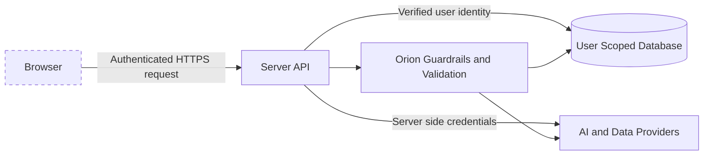

# Security Overview

Prometheus handles sensitive financial context, so the design treats authentication, data isolation, secret management, and responsible AI behavior as core product requirements.

## Security Objectives

- Protect user identity and financial information.
- Prevent one user from accessing another user's memory or records.
- Keep provider credentials and privileged database access on the server.
- Limit the effect of prompt injection, malformed input, and unauthorized tool use.
- Present financial outputs as explainable educational guidance rather than guaranteed outcomes.

## Trust Boundaries

The browser is treated as an untrusted client. User identifiers, permissions, financial calculations, provider calls, and memory access must be verified or performed server side.

## Controls

### Authentication and authorization

- Supabase authentication establishes user identity.
- Protected routes require a verified session.
- Server code should derive the user ID from the verified session rather than trusting a browser supplied ID.
- Database access should be scoped to the authenticated user.

### Secret management

- API keys and database credentials are stored as server side environment variables or platform secrets.
- Secrets must never appear in frontend bundles, public documentation, logs, screenshots, or Git history.
- `.env` files are excluded from source control and represented only by a sanitized `.env.example` in a private application repository.

### AI and tool safety

- Input validation rejects malformed or unsupported requests.
- Guardrails distinguish education and decision support from regulated financial advice.
- Tool access should be allowlisted and permission checked.
- Structured calculations should use deterministic finance functions where practical.
- External data should be labeled with source timing and limitations.
- Responses should surface uncertainty, assumptions, and warnings rather than presenting predictions as facts.

### Memory and privacy

- Long term memory should store only information required to improve the user experience.
- Memory records must be user scoped.
- Sensitive data should not cross application boundaries without explicit authorization.
- Logs should avoid account numbers, credentials, full financial records, and model provider secrets.

### Reliability

- Provider calls should use timeouts and bounded retries.
- Errors returned to the browser should be safe and should not reveal stack traces or internal configuration.
- Financial calculations should be validated before presentation.
- Rate limiting should be applied to high cost or abuse prone endpoints.

## Threat Model Summary

| Risk | Example | Primary mitigation |
|---|---|---|
| Prompt injection | User attempts to override Orion's safety rules | Guardrails, tool allowlists, instruction boundaries |
| Cross user access | A request attempts to retrieve another user's memory | Verified sessions and user scoped queries |
| Secret exposure | Provider key is bundled into frontend JavaScript | Server side environment variables |
| Hallucinated finance data | Model invents a rate or market figure | Deterministic tools, provider data, source labels, validation |
| Tool abuse | Model attempts an unauthorized operation | Permission checks and explicit tool registry |
| Overconfident advice | Output presents a prediction as guaranteed | Risk disclosures, assumptions, confidence language |
| Dependency compromise | A package introduces malicious code | Lockfiles, dependency review, automated scanning |

## Public Repository Policy

The public showcase excludes production credentials, private prompts, proprietary Orion implementation, database exports, user information, and internal security configuration. Security vulnerabilities should not be posted publicly with exploit details.